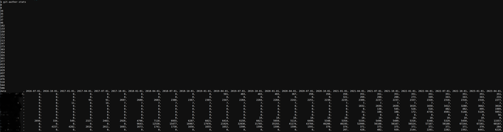

### Example Run

Copy/paste into python, excel, whatever, then plot

### TODO

* Threadpool around each "git blame" call, or maybe around each date
* Add an option to display details at a single date, and maybe with a single author to confirm accuracy
* Use to analyze other repos
* Add cli arguments to specify dates, sampling interval
